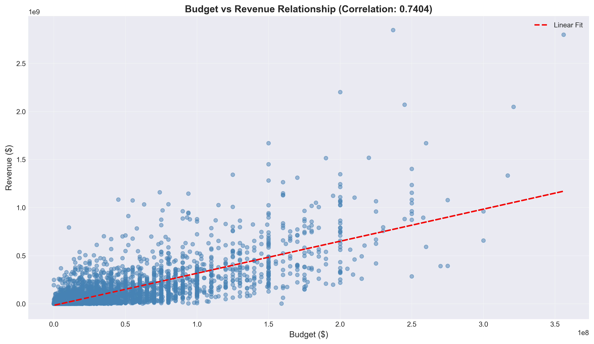
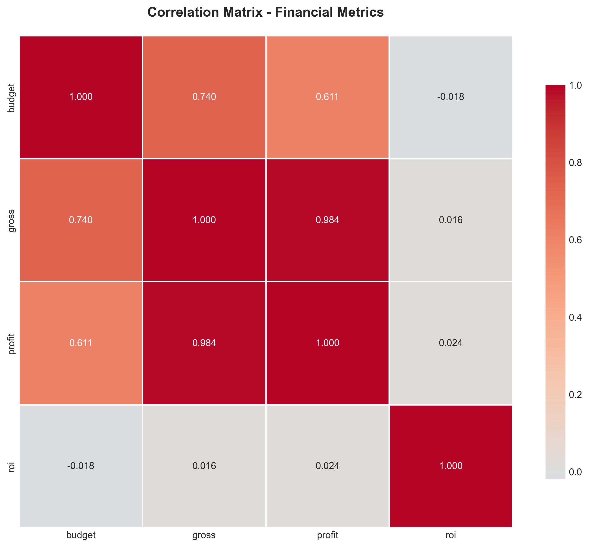
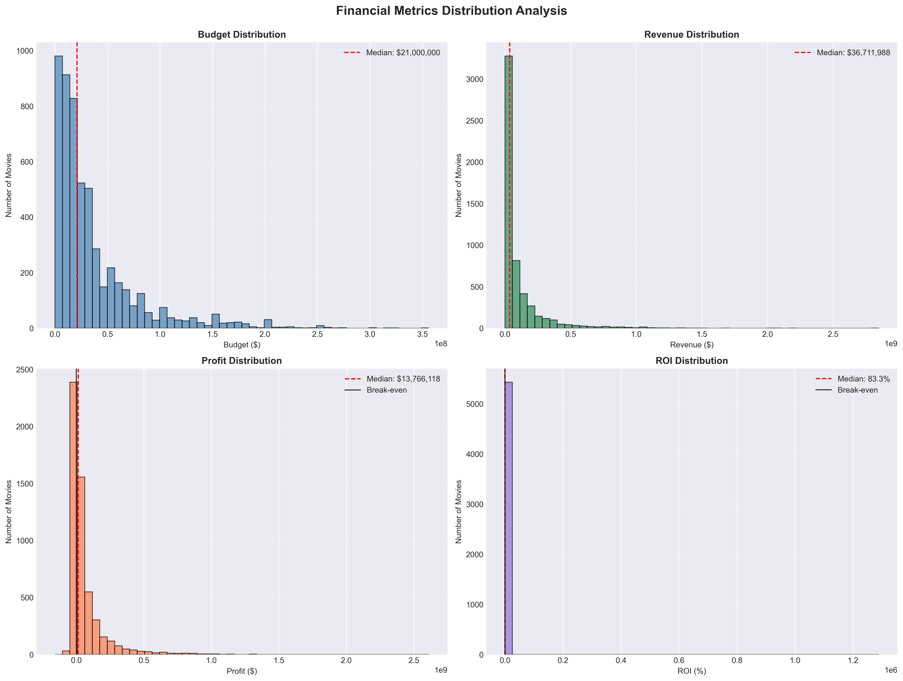
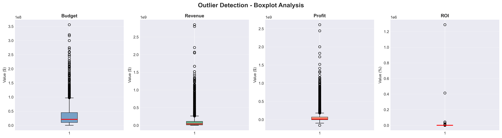

# 🎬 Movies Budget vs Revenue Analysis

**Analyzing the correlation between production budget and box office revenue in the film industry**

[](https://www.python.org/)
[](https://jupyter.org/)

---

## 📊 Project Overview

This project investigates the relationship between movie production budgets and box office revenue, analyzing data from over 5,400 films to uncover patterns and insights about financial performance in the entertainment industry.

**Research Questions:**
- Is there a correlation between budget and revenue?
- How strong is this relationship?
- What percentage of revenue variance can be explained by budget?
- Which movies achieve the highest profitability and ROI?

---

## 🎯 Key Findings

- **Strong Positive Correlation**: 0.7468 between budget and revenue (statistically significant, p < 0.001)
- **Variance Explained**: Budget accounts for 55.77% of revenue variance (R² = 0.5577)
- **Profitability Rate**: Approximately 85% of movies analyzed were profitable
- **Median ROI**: 83.29%
- **Average Profit**: ~$67 million per movie

---

## 🛠️ Technologies & Tools

- **Python 3.8+**
- **Pandas** - Data manipulation and cleaning
- **NumPy** - Numerical operations
- **Matplotlib & Seaborn** - Data visualization
- **SciPy** - Statistical analysis and hypothesis testing
- **Jupyter Notebook** - Interactive development environment

---

## 📁 Project Structure
```
movie-correlation-python/
│
├── data/
│   ├── raw/                    # Original dataset
│   └── cleaned/                # Processed dataset
│
├── notebooks/
│   └── movie_budget_revenue_analysis.ipynb
│
├── images/
│   ├── distribution_histograms.png
│   ├── correlation_heatmap.png
│   ├── budget_revenue_scatter.png
│   └── boxplot_outliers.png
│
└── README.md
```

---

## 🚀 How to Run This Project

### 1. Clone the repository
```bash
git clone https://github.com/leversoncampos/movie-correlation-python.git
cd movie-correlation-python
```

### 2. Install dependencies
```bash
pip install pandas numpy matplotlib seaborn scipy jupyter
```

### 3. Launch Jupyter Notebook
```bash
jupyter notebook
```

### 4. Open the analysis notebook
Navigate to `notebooks/movie_budget_revenue_analysis.ipynb` and run all cells.

---

## 📈 Visualizations

### Budget vs Revenue Correlation


*Strong positive correlation (0.7468) between production budget and box office revenue*

### Correlation Matrix


*Relationships between budget, revenue, profit, and ROI*

### Distribution Analysis


*Distribution patterns of key financial metrics*

### Outlier Detection


*Identification of extreme values and outliers*

---

## 📊 Methodology

1. **Data Loading & Inspection** - Explored 7,668 movie records
2. **Data Quality Assessment** - Identified and documented quality issues
3. **Data Cleaning** - Removed invalid records, retained 5,436 movies (70.9%)
4. **Feature Engineering** - Created Profit and ROI metrics
5. **Exploratory Data Analysis** - Statistical summaries and distributions
6. **Correlation Analysis** - Pearson correlation, hypothesis testing, regression
7. **Insights & Conclusions** - Business implications and recommendations

---

## 💡 Key Insights

### Main Findings

✅ **Strong Budget-Revenue Relationship**
- Correlation of 0.7468 indicates a strong positive relationship
- Statistically significant (p < 0.001)

✅ **Budget Explains 56% of Revenue Variance**
- R² = 0.5577 means 44% is explained by other factors
- Marketing, cast, genre, and timing also play critical roles

✅ **High Industry Profitability**
- 85% of movies are profitable
- Median ROI of 83.29% demonstrates healthy returns

✅ **Wide Performance Variance**
- Top performers achieve ROI exceeding 1000%
- Budget size doesn't guarantee success

### Business Implications

- Higher budgets generally lead to higher revenues, but correlation ≠ causation
- Strategic budget allocation should consider multiple factors beyond cost
- ROI analysis is crucial - sometimes lower-budget films outperform blockbusters
- Data-driven decisions require multivariate models, not just budget analysis

---

## 📊 Data Source

**Dataset**: [Movies Dataset - Kaggle](https://www.kaggle.com/datasets/danielgrijalvas/movies)

- **Original Records**: 7,668 movies
- **After Cleaning**: 5,436 movies
- **Key Variables**: budget, gross revenue, profit, ROI, genre, rating, year

---

## 🙏 Acknowledgments

- Dataset provided by [Kaggle](https://www.kaggle.com/)
- Inspired by real-world financial analysis in the entertainment industry
- Built as a portfolio project demonstrating data analysis skills

---

⭐ **If you found this project insightful, please consider giving it a star!**
